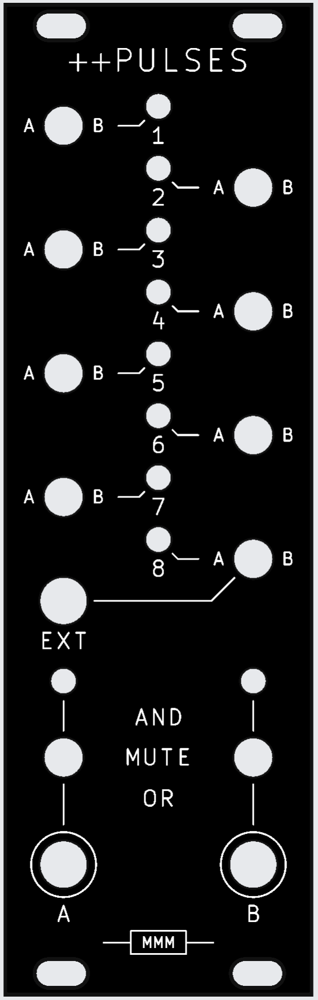

# Pulses Plus

A performance-oriented gate router for the Music Thing Turing Machine. Eight pulse channels,
each switchable to one of two merge buses or off; each bus computes the OR or the AND of
whatever is routed to it, chosen live from the panel.

<p align="center">
  
</p>

**Built and tested.** 8 HP, 128.5 × 40.16 mm.

It sits **alongside** a stock Pulses expander rather than replacing it, taking its signals from
the Turing Machine's 16-pin expander ribbon and passing that ribbon through so other expanders
can still be chained downstream.

The stock Pulses gives you seven fixed outputs plus four hard-wired AND combinations. Those AND
outputs are the musical ones — ANDing two shift-register taps gives a sparser, related rhythm.
This generalises that: any subset of the eight bits, OR'd or AND'd, chosen by hand, live. The
four fixed ANDs become a strict subset of what the switches can do.

---

## What's here

| | |
|---|---|
| `pulses_plus_submin.kicad_sch` | schematic — 87 placed components |
| `pulses_plus_submin.kicad_pcb` | main board |
| **`pulses_plus_submin_panel_v4.kicad_pcb`** | **current panel** |
| `pulses_plus_submin_panel.kicad_pcb` | v1 panel — the geometry source `build_panel.py` inherits holes from |
| `pulses_plus_submin.pretty/` | project footprints — toggle, jack, LED, panel holes |
| `switch_fix.kicad_sym` | the DPDT symbol with the pin numbering the footprint expects |
| `3d/` | 3D models the footprints reference |
| `BOM.md` | bill of materials, DigiKey and JLCPCB/LCSC columns |
| `BOM_DigiKey.csv` | the same BOM as a DigiKey cart upload |
| `gerbers/` | fab packages — see below |
| `tools/build_panel.py` | regenerates the panel artwork |
| `PANEL_STYLE_v1.04.md` | the panel house style |
| `docs/pulses-plus-design.md` | full design write-up, including the diode-leak analysis and why 6 HP was abandoned |
| `docs/sw-t2-4x-b-a2-ma2-data-sheet.pdf` | Taiway 200-MDP3 toggle datasheet |

### Which gerbers to order

`gerbers/` accumulated every revision that was sent out. The current pair is:

- **Board** — `controlv2.zip`
- **Panel** — `panelv4.rar`

The loose `.gbr`/`.drl` files at the top of `gerbers/` are the most recent plot of the
main board and the v1/v2 panels, kept unzipped for inspection.

## How it works

Each channel's DPDT ON-OFF-ON toggle throws left to bus A, right to bus B, or centre for off.
Both poles are used: pole 1 carries only the OR diodes, pole 2 only the AND diodes. That
separation is the one non-obvious constraint in the design — sharing a pole leaks current
through the unselected bus and pins its OR net high.

Per bus, a second toggle picks OR, MUTE or AND. Both nets are computed continuously and in
parallel, so the mode switch only selects which one reaches the output buffer and the 32 merge
diodes never switch. Centre-off leaves the buffer input pulled low, which is the mute.

The **EXT** jack is switched (normalled): unplugged, buffered BIT8 feeds channel 8; plugged, an
external gate takes its place through a transistor and Schmitt stage that squares up whatever
amplitude arrives.

Full write-up: **[`docs/pulses-plus-design.md`](docs/pulses-plus-design.md)**.

## Using it

The two buses are **two independent reads of the same shift register**. Whatever either one
plays is built from the same eight bits on the same loop, so they cannot drift apart — but give
them different channels, or put one in AND and the other in OR, and they come out at different
densities. Related, never identical. Most of the musical mileage is in that gap.

### Gates on A, note changes on B

The patch this turned out to be best at, and not one it was designed for:

1. **OUT A → your envelope or VCA gate.** A few channels to bus A in **OR** — a busy,
   rhythmic gate stream.
2. **OUT B → a quantizer's trigger or sample input**, with the Turing Machine's CV output
   feeding that quantizer's CV input. A *different*, smaller set of channels to bus B, in
   **AND** for something sparser again.

The quantizer only samples when bus B fires, so the note is **held** across every gate bus A
produces in between. A melody moves on its own slow rhythm while the gates articulate
underneath — and because both rhythms are subsets of one register, the note changes land on
beats the gate pattern already stresses. It reads as a phrase, not as two voices running at
once.

Being a Turing Machine underneath, the loop-length and randomness controls then act on the
whole thing at once: lock the register for a repeating riff, open it a crack and the melody
mutates while staying in its scale.

**Pulse width passes straight through.** The board is purely combinational: it merges what
arrives on the ribbon and never looks at the clock. It does not need to — the Turing Machine's
expander bus already carries each bit ANDed with the clock, so the bits arrive as *pulses*, and
the diode merge preserves their width. Feed the TM a narrow clock and the outputs are narrow;
feed it a wide one and they are wide, all the way to OUT A and OUT B.

So an AND that is true on three consecutive steps gives three pulses, one per step — each
re-triggering the envelope or re-pinging the quantizer, rather than merging into one long gate.
The note changes on every step the condition holds, which is why choosing a condition that comes
true *rarely* is what makes the melody move slowly.

**Things to reach for:**

- **B in AND with two or three channels** is the sweet spot. AND of several bits comes true
  rarely, which is what you want from a melody that moves every few bars rather than every step.
- **MUTE on B** freezes the pitch without touching the gate pattern — drop the melody in and
  out by hand mid-take. That is what the centre position is for.
- **The EXT jack earns its keep here.** Patch an outside rhythm into channel 8 and AND it into
  bus B, and the note only changes where your own pattern and the Turing Machine agree —
  a melody keyed to something the TM knows nothing about.
- An **AND bus with nothing routed to it sits high**, held there by its 10k pull-up rather than
  driven by any bit, so it never pings anything. Route at least one channel to a bus you want
  triggers from.

## Key parts

10 × Taiway 200-MDP3 sub-miniature DPDT ON-OFF-ON toggles (ø4.95 bushing), 2 × CD4050 buffers,
1 × CD40106 Schmitt, 33 × 1N4148, 10 × 3 mm LEDs, 3 × Thonkiconn jacks — **J3 must be the
switched variant** — and 2 × 2×8 IDC headers for ribbon in and thru. See [`BOM.md`](BOM.md).

---

## Panel

The current panel is **v4**, `pulses_plus_submin_panel_v4.kicad_pcb` — white silkscreen on black
soldermask, drawn to [`PANEL_STYLE_v1.04.md`](PANEL_STYLE_v1.04.md).

It is generated. [`tools/build_panel.py`](tools/build_panel.py) reads the v1 panel and regenerates
only the artwork, inheriting every control-hole position, so the style guide's one non-negotiable
rule — hole positions are inherited, never computed — holds by construction rather than by
inspection:

```sh
python3 tools/build_panel.py
```

Mounting is four 6.4 × 3.2 mm obround slots on Edge.Cuts, horizontal for ±1.6 mm of slide.
`kicad-cli pcb drc` reports zero violations. Zones refill on open — refill before plotting.

Reading the panel: a ring means signal leaves there, so the two output jacks are the only closed
circles. `A`/`B` beside each toggle are throw directions, not names. The mode stack is `AND` up,
`MUTE` centre, `OR` down. Names sit below the thing they name.

---

## Related repositories

- **[Doubleplus_Pulses_VCV](https://github.com/kuangmk11/Doubleplus_Pulses_VCV)** — a VCV Rack 2 port
  of this module. It reconstructs the Turing Machine's shift register locally, so it runs without
  the hardware.
- **[Turing-Pulse-Expander](https://github.com/kuangmk11/Turing-Pulse-Expander)** — the archive:
  Tom Whitwell's original Rev 2 expander, plus the superseded studies this design grew out of.

## Licence

CC BY-NC-SA 4.0 — see [`LICENSE`](LICENSE).
